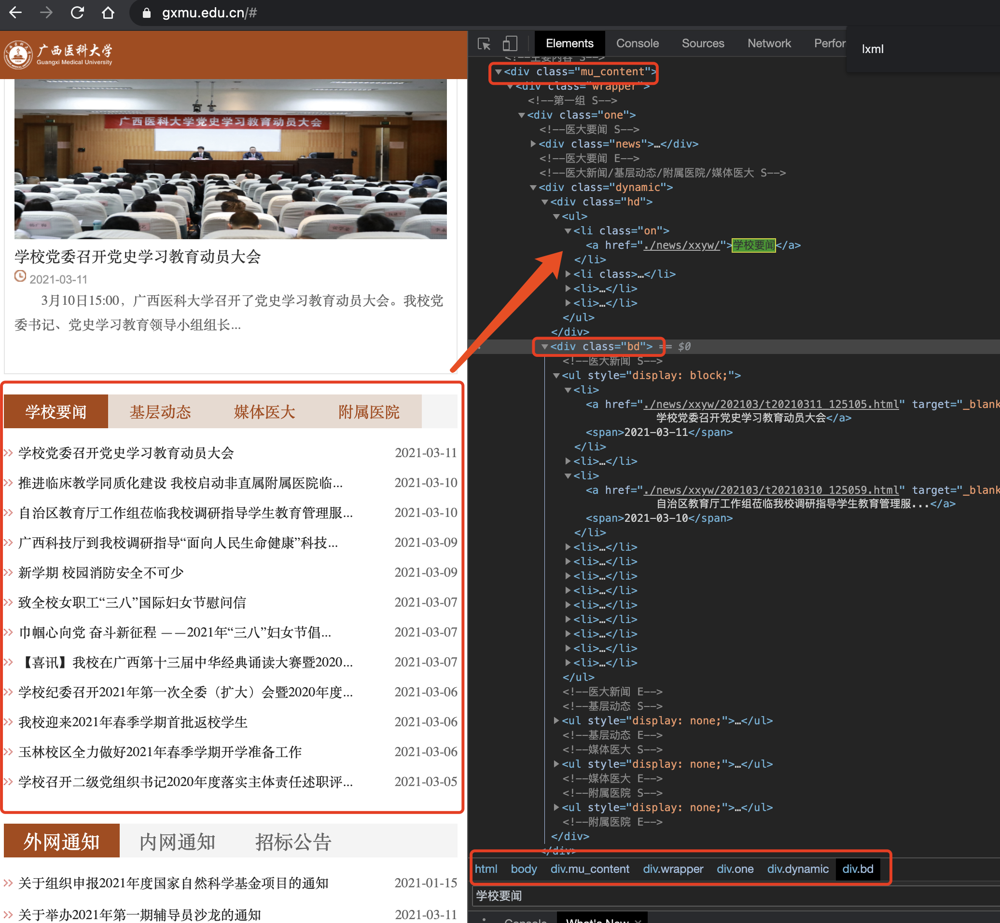
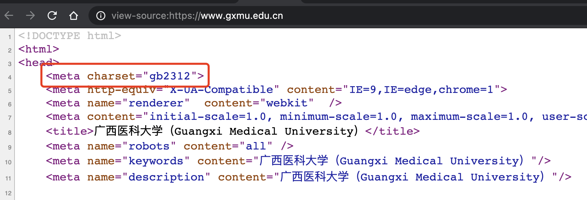

# 用Python来实现爬虫





```
p3 compus-news.py 

--- 命令行参数: ['compus-news.py']
--- api_url:  https://www.gxmu.edu.cn/

--------------- 今日要闻 ---------------
2021-03-11 学校党委召开党史学习教育动员大会
2021-03-10 推进临床教学同质化建设 我校启动非直属附属医院临床骨干教师教学进修工作
2021-03-10 自治区教育厅工作组莅临我校调研指导学生教育管理服务工作
2021-03-09 广西科技厅到我校调研指导“面向人民生命健康”科技创新工作
2021-03-09 新学期 校园消防安全不可少
2021-03-07 致全校女职工“三八”国际妇女节慰问信
2021-03-07 巾帼心向党 奋斗新征程 ――2021年“三八”妇女节倡议书
2021-03-07 【喜讯】我校在广西第十三届中华经典诵读大赛暨2020广西校园中华经典诵读大赛斩获佳绩
2021-03-06 学校纪委召开2021年第一次全委（扩大）会暨2020年度二级纪委书记述职评议大会
2021-03-06 我校迎来2021年春季学期首批返校学生
2021-03-06 玉林校区全力做好2021年春季学期开学准备工作
2021-03-05 学校召开二级党组织书记2020年度落实主体责任述职评议会议
2021-03-10 生科院召开2021年春季学期开学学生工作布置会
2021-03-09 药学院党委召开2020年度支部书记述职考评大会暨2021年党建工作布置会
2021-03-09 继教院开展2021级成人新生报到接待工作
2021-03-09 教评中心组织开展线下教学督导工作
2021-03-08 教务处党支部召开2020年度组织生活会和民主评议党员
2021-03-08 玉林校区迎来2021年春季学期学生返校
2021-03-05 玉林校区开学第一周：线上教学运行平稳有序
2021-03-04 校领导指导中国-东盟实验动物科创中心项目建设
2021-03-03 信息与管理学院召开2021年新学期开学工作布置会议
2021-03-03 新年伊始，未雨绸缪――基础医学院领导走访检查新学期开学工作
2021-03-02 校领导带队检查校本部后勤保障开学准备工作
2021-03-01 基础医学院召开2021年春季学期开学工作会议
2021-03-10 【媒体看医大】“创争”力量 梁浩：笃志攻关三十载，逆流奋战传染病
2021-03-04 【媒体看医大】广西日报报道我校新增3个本科专业
2021-01-29 【媒体看医大】光明日报报道我校教学质量发展情况
2021-01-08 【媒体看医大】广西法治日报报道我校人文社会科学学院社会工作专业实训基地实效
2020-12-28 【媒体看医大】光明日报、中国护士网、广西日报等多家媒体报道全国第二家南丁格尔精神宣教馆落户广西医科大学
2020-12-17 【媒体看医大】广西日报、广西卫视报道自治区宣讲团党到我校举行的十九届五中全会精神报告会
2020-12-03 【媒体看医大】中国社会科学报刊发我校人文社会科学学院教师的主题文章：推动新时代基层卫生健康高质量发展
2020-11-26 【媒体看医大】人民网、中新网、广西日报等多家媒体报道我校协办的2020中国―东盟医院管理合作论坛
2020-11-19 【媒体看医大】广西日报：广西基层卫生健康发展研究中心负责人左延莉教授献策《建设高质量基层卫生人才队伍》
2020-11-18 【媒体看医大】广西日报、广西电视台、南国早报报道我校2021届广西医药类高校毕业生就业双选会
2020-11-18 【媒体看医大】广西日报、南国早报报道中国南丁格尔志愿护理服务总队广西医科大学护理学院分队成立
2020-10-26 【媒体看医大】广西日报：发挥医学主优势 小切口出大疗效
2021-03-11 聚焦精益求精，创新发展模式――二附院召开2021年平衡计分卡指标研讨系列会议
2021-03-11 附属肿瘤医院放疗科三病区举办
2021-03-11 附属肿瘤医院妇科党支部赴武鸣开展“宫颈癌健康教育及预防行动”主题党日活动
2021-03-11 自治区卫生健康委联合广西消防救援总队到附属肿瘤医院开展安全生产检查
2021-03-11 附属肿瘤医院举行多项活动庆祝“三八”国际妇女节
2021-03-10 梧州市工人医院到一附院儿科党支部开展党建联盟结对共建座谈
2021-03-10 春回大地，共享盛世――口腔医院开展离退休职工“三八”妇女节活动
2021-03-09 附属肿瘤医院携手自治区妇联启动广西“巾帼健康行动”公益科普筛查活动
2021-03-08 附属肿瘤医院检验病理供应党支部举行“扶贫济困 捐资助学”党群学子交流座谈会
2021-03-08 致敬志愿者！回顾过去一年附属肿瘤医院的志愿服务
2021-03-08 自治区卫健委专家审查组莅临一附院进行医疗机构执业校验现场审查
```